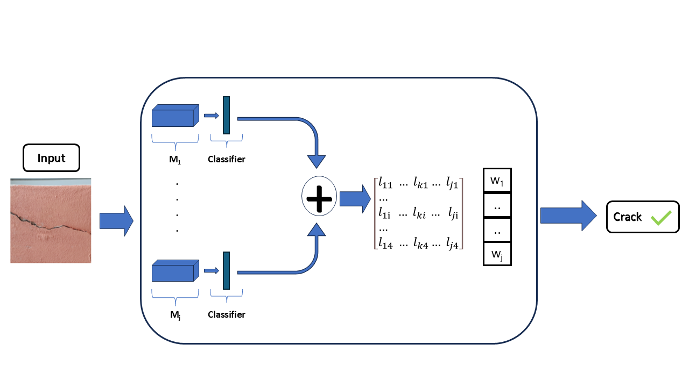

# Ensembles-of-deep-neural-networks-for-the-automatic-detection-of-building-facade-defects-from-images

## Abstract
Ensuring that buildings maintain their value and performance throughout their lifespan requires continuous monitoring. Without this, building usage may not be guaranteed. Traditional inspection methods rely on experts visually examining components, which is both time-intensive and costly. Therefore, these methods may not be sustainable or cost-effective.

Artificial intelligence has emerged as a promising supplement to traditional inspection practices, particularly for building maintenance in smart cities. Machine learning algorithms, when used to detect or classify facade defects from images, offer a powerful approach to automate building monitoring.

This work introduces a new classification protocol using ensemble strategies applied to modern deep neural networks like Vision Transformers and ConvNeXts for automatic building facade defect classification. We propose two ensemble methodologies: an **average ensemble** and a **learnable ensemble**. Our custom dataset, **Facade Building Defects (FBD)**, includes facade images labeled with four defect classes, which we release as open access.


*Figure 1: Schematic representation of the proposed pipeline.*

## Getting Started
### Download the dataset

The FBD dataset, along with download instructions, is available at the following link: [FBD dataset](https://github.com/Malga-Vision/FBD-Dataset/tree/main).  
After downloading and extracting the files, place them in a folder named **split**. 

### Running Experiments
To begin, open a terminal and navigate to the main project folder.

#### Train individual models
To train and test individual models, use the script **train_test_single_model.py**. This script accepts the following parameters:  
```
 -data_dir # Path to the full dataset directory
 -log_dir # Directory for logging results
 -seed # Seed for splitting the training set into train and validation sets
 -max_num_epochs # Maximum training epochs (default: 200)
 -model_name # Model to train; options are: 'vit', 'swin', 'swin_t', 'convnext', 'resnet', 'densenet', 'vgg'
 -optimizer # Optimizer name (default: 'adam')
 -scheduler # Training scheduler (default: 'plateau')
 -lr # Initial learning rate (default: 0.000001)
 -weight_decay # Weight decay value (default: 0.001)
```
### Extract logits
Before applying ensemble strategies, extract logits for the models included in the ensemble. Run the **extract_logits.py** script, which takes the same parameters as **train_test_single_model.py** plus the following:
```
-model_in_ensemble # List of models to include in the ensemble
```


### Average ensemble
The average ensemble method requires no training. To test the average ensemble with specific models on the validation set (using a specified seed), use **val_average_ensemble.py**. To test on the test set, use **test_average_ensemble.py**. Both scripts accept the same parameters as **extract_logits.py**.

### Learnable ensemble
The **train_test_learnable_ensemble.py** script trains a learnable ensemble on the training set using specific models, then performs inference on the test set. Use the same parameters as **extract_logits.py**.
